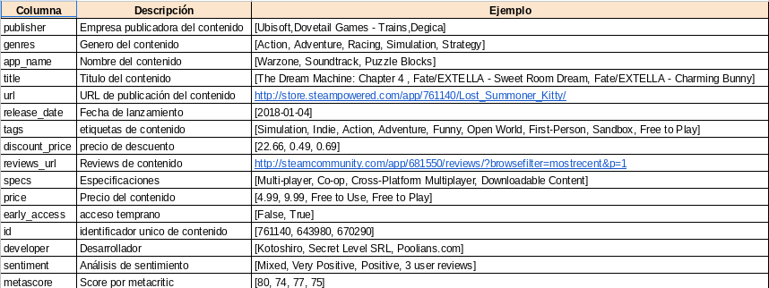
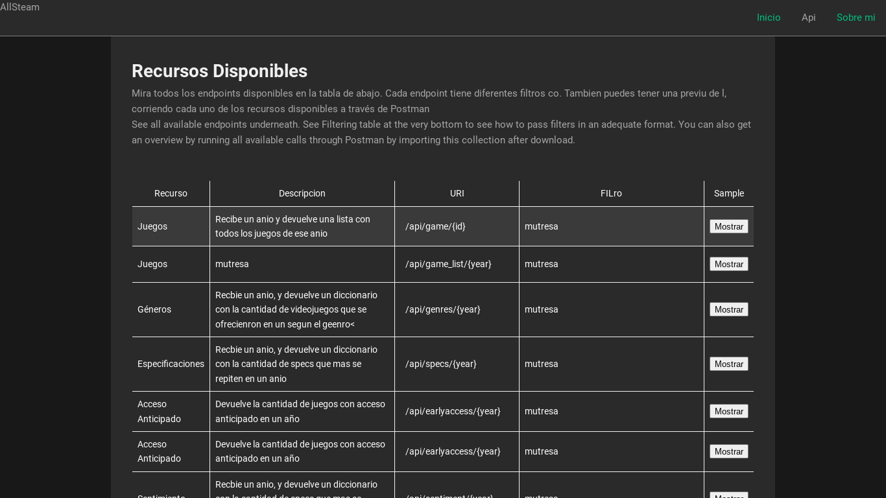

# <h1 align=center> **Servicio API Rest con Integración de Machine Learning** </h1>

El proyecto que se presenta a continuación consiste en el desarrollo de un Servicio API Resful para el consumo de un dataset de videojuegos de Steam. Asimismo, incluye la integración de un modelo de regresión de Machine Learning para la predicción de precios de videojuegos.

El proyecto fue una propuesta dada por el Bootcamp SoyHenry para la carrera de Ciencia de Datos, y corresponde al primer proyecto individual obligatorio para graduarse del Bootcamp. A lo largo del siguiente README.md, se encuentra una versión resumida de la consigna orignal del proyecto, el desarrollo que se llevó a cabo para su evaluación, ejemplos del funcionamiento de la API y la documentación para su debido uso.

El proyecto tuvo una duración de una semana para ser completado, y se creó un video explicativo con el funcionamiento de la API.

## **Propuesta de Trabajo Original**

### Rol a desarrollar

Se empezó a trabajar como **`Data Scientist`** en Steam, una plataforma multinacional de videojuegos. La tarea es desarrollar una servicio API rest para el consumo de los videojuegos y un modelo de Machine Learning capaz de predecir el precio de un videojuego.

Los datos se encuentran en un grado de madurez bastante poco o casi nulo: datos anidados, sin transformar, no hay procesos automatizados para la actualización de nuevos productos, entre otras cosas, haciendo un trabajo imposible de realizar.

En este sentido, se debe empezar de cero haciendo un trabajo rápido de **`Data Engineer`** y tener un **`MVP`** (_Minimum Viable Product_) para el cierre del proyecto. El trabajo es duro, pero al menos se tiene una idea de como encaminar el proyecto:

<p align="center">
  
</p>

### **Fuente de datos**

+ [Dataset](https://drive.google.com/drive/folders/1HqBG2-sUkz_R3h1dZU5F2uAzpRn7BSpj?usp=drive_link): Carpeta con los datasets a utilizar.
+ **Diccionario de datos**: Diccionario con algunas descripciones de las columnas disponibles en el dataset.

<p align="center">
  
</p>

### **Criterios de Evalución**

**`Transformaciones`**:  Para este MVP no es necesario transformar los datos dentro del dataset, pero se trabajará leer el dataset con el formato correcto.

**`Desarrollo API`**: Se solicitó el desarrollo de los siguientes endpoints para que el proyecto fuera aprobado:

+ def **genero( _`Año`: str_ )**: Se ingresa un año y devuelve una lista con los 5 géneros más vendidos en el orden correspondiente.

+ def **juegos( _`Año`: str_ )**: Se ingresa un año y devuelve una lista con los juegos lanzados en el año.

+ def **specs( _`Año`: str_ )**: Se ingresa un año y devuelve una lista con los 5 specs que más se repiten en el mismo en el orden correspondiente.

+ def **earlyacces( _`Año`: str_ )**: Cantidad de juegos lanzados en un año con early access.

+ def **sentiment( _`Año`: str_ )**: Según el año de lanzamiento, se devuelve una lista con la cantidad de registros que se encuentren categorizados con un análisis de sentimiento.

+ def **metascore( _`Año`: str_ )**: Top 5 juegos según año con mayor metascore.

## Elaboración del Proyecto

### 1. Preparación de los Datos para el Consumo de la API

De acuerdo a la consigna del ejercicio, los datos ya estaban listos para ser consumidos por la API. Sin embargo, con el fin de mejorar la calidad de las response, se hizo una revisión de los datos originales los cuales habían sido entregados en formato.json.

De forma resumida, los cambios más importantes que se hicieron fueron los siguiente:

+ **Fecha de Lanzamiento:** Todo videojuego que no tuviera fecha de lanzamiento se eliminó, puesto que todos los endpoint solicitados hacen uso de la fecha: un videojuego sin fecha nunca podría ser consultado. Asimismo, toda fecha que no estuviera en el formato `año/mes/dia` se eliminó por mantener la prolijidad de los datos.
+ **Columna title y app_title:** Se hizo una evaluación de los valores repetidos entre la column title y app_title del dataset, y ambas columnas tenían exactamente los mismos valores. En este sentido, se eliminó una de ellas: title.
+ **Valores nulos:** Todo valor nulo se cambió a una cadena de texto que reflejara la ausencia del dato, ya que los valores nulos pueden provocar errores de tokenización al ser deserializados por el cliente.

Dentro de la capera docs se encuentra documentado el proceso que se realizó en el archivo API_data_preparation. Está tanto en formato .pdf como el notebook con el codigo original.

### 2. Modelamiento de Machile Learning

Se realizó un EDA sencillo de los datos originales para determinar como estaba compuesto el dataset y los datos mas imporantes. La mayoría de los datos eran campos categóricos o columnas con listas anidadas, por lo que había una ausencia de variables numéricas con una correlación al precio que permitiera desarrollar un buen modelo de predicción. Por esta naturalieza, el modelo solicitado se pudo preveer como poco preciso desde antes de hacer el modelamiento.

Para el entrenamiento final se usaron las siguientes features:

+ **Precio:** Valores no iguales a 0 y menores a 60, el resto se considero outliers y no se consideró óptimo evaluar juegos gratuitos.
+ **Fecha de lanzamiento.**
+ **Cantidad de Etiquetas:** Columnas nueva que no estaba en el dataset orginal. Refleja cuantas etiquetas ha recibo un un videojuego.
+ **Cantidad de Especificaciones:** Columna nueva que no estaba en el dataset orignal. Refleja cuantas especificaciones tenía un videojuego.
+ **Metascore.**
+ **Sentimiento.**
+ **Géneros**: Se realizó One Hot Encoding de la columna genres obteniendo ocho columnas nuevas: indie, casual, action, sports, racing, strategy, rpg y simulation.

Cabe resaltar que ninguna de estas features logró una correlación lineal con el precio mayor a 0.4: fecha de lanzamiento fue la mejor con 0.35. Esto quiere decir que ninguna de las features selectas se podría considerar buena para predecir el precio de un videojuego.

Tras tener estos datos listos y como se observó que no eran buenos para este caso en particupar de predicción, se realizó una evaluación de múltiples modelos de Machine Learing de regresión buscando el mejor. El modelo Lars fue el mejor obteniendo los siguientes puntajes:

+ **R2**: 0.36 o 36%
+ **RMSE**: 6.2

Estos números claramente no fueron del todo favorables, pero esto se debe pricipalmente a la naturaleza orignal de los datos que no permiten un mejor modelo. De igual forma, el modelo se exportó en formato pkl para su posterior consumo dentro de la api en el archivo fitted_model.pkl, en la carpeta api/pkl.

Dentro de la capera docs se encuentra documentado el proceso que se realizó en el notebook eda_and_data_modeling.ipynb

### 3. Exportación de la Data

Luego de tener un dataset limpio para el consumo de la API y un modelo de Machile Learning ya entrenado, ambos archivos se exportaron en format.pkl dentro de la carpeta /api/pkl. Los archivos pkl son un formato de serialización binaria.

Este permite la reutilización constante de clases ya instancias a un tamaño bastate reducido.

### 4. Desarrollo del Servicio APIRest

Con el archivo steam_games.pkl se desarrollaron los seis endpoints tipo `GET` y con fitted_model.pkl el endpoint tipo `POST` con la integración del Modelo de Machine Learning. Para crear el servidor se usó Flask, y para manipular el dataframe se desarrollaron funciones especiales en el archivo controller.py dentro de la carpeta api/utils.

### 5. Frontend de la Aplicación (Toque Personal 😉)

Con el fin de mostrar el funcionamiento de la API y una documentación más interactiva, se desarrolló un frontend sencillo en donde se puede encontrar más información de los endpoints y ejemplos de uso. Asimismo, se dispone un formulario totalmente funcional para testear el modelo de Machine Learning de forma rápida. El frontend se hizo con Vue, y todo el código se encuentra disponible dentro de la carpeta client.

_**NOTA**: La creación de un frontned no fue parte de la consigna original. Fue un toque personal_

<p align="center">
  
  <p align="center"><strong>Página de Inicio</strong></p>
</p>

<p align="center">
  
  <p align="center"><strong>Página de Documentación</strong></p>
</p>

### Despliegue y Testeo

Luego de verificar el funcionamiento en local, el proyecto se llevó a producción utilizando el servicio Render: https://steam-games-api-services.onrender.com

## Documentación de la API

En el sitio web se encuentra la [documentación](https://steam-games-api-services.onrender.com/api) de la API con ejemplos de como realizar las consulas. No obstante, de igual forma a continuación se provee de la documentacion de la API y ejemplos de uso. Al hacer click en cualquiera de los los siguientes links, se despliega muestras de uso y respuestas.

### Juego por Identificación de Steam

<details>
  <summary>
    <code>GET</code>
    <code><b>/api/game/{id}</b></code>
  </summary>

#### Ejemplo de Uso

```txt
https://steam-games-api-services.onrender.com/api/game/670290
```

#### Ejemplo de Respuesta

```json
{
  "app_name": "Real Pool 3D - Poolians",
  "developer": "Poolians.com",
  "discount_price": 0,
  "early_access": false,
  "genres": ["Casual","Free to Play","Indie","Simulation","Sports"],
  "id": 670290,
  "metascore": "no_score",
  "price": "Free to Play",
  "publisher": "Poolians.com",
  "release_date": "Mon, 24 Jul 2017 00:00:00 GMT",
  "reviews_url": "http://steamcommunity.com/app/670290/reviews/?browsefilter=mostrecent&p=1",
  "sentiment": "Mostly Positive",
  "specs": ["Single-player","Multi-player","Online Multi-Player","In-App Purchases",
"Stats"],
  "tags": ["Free to Play","Simulation","Sports","Casual","Indie","Multiplayer"],
  "url": "http://store.steampowered.com/app/670290/Real_Pool_3D__Poolians/"
}
```

</details>

### Lista de Juegos por Año de Publicación

<details>
  <summary>
    <code>GET</code>
    <code><b>/api/gamelist/{year}</b></code>
  </summary>

#### Ejemplo de Uso

```txt
https://steam-games-api-services.onrender.com/api/gamelist/2018?limit=2
```

#### Ejemplo de Respuesta

```json
{
  "2018": [
    {
      "app_name": "Lost Summoner Kitty",
      "developer": "Kotoshiro",
      "discount_price": 4.49,
      "early_access": false,
      "genres": ["Action","Casual","Indie","Simulation","Strategy"],
      "id": 761140,
      "metascore": "no_score",
      "price": 4.99,
      "publisher": "Kotoshiro",
      "release_date": "Thu, 04 Jan 2018 00:00:00 GMT",
      "reviews_url": "http://steamcommunity.com/app/761140/reviews/?browsefilter=mostrecent&p=1",
      "sentiment": "no_sentiment",
      "specs": ["Single-player"],
      "tags": ["Strategy", "Action", "Indie", "Casual", "Simulation"],
      "url": "http://store.steampowered.com/app/761140/Lost_Summoner_Kitty/"
    },
    {
      "app_name": "Ironbound",
      "developer": "Secret Level SRL",
      "discount_price": 0,
      "early_access": false,
      "genres": ["Free to Play", "Indie", "RPG", "Strategy"],
      "id": 643980,
      "metascore": "no_score",
      "price": "Free To Play",
      "publisher": "Making Fun, Inc.",
      "release_date": "Thu, 04 Jan 2018 00:00:00 GMT",
      "reviews_url": "http://steamcommunity.com/app/643980/reviews/?browsefilter=mostrecent&p=1",
      "sentiment": "Mostly Positive",
      "specs": ["Single-player","Multi-player","Online Multi-Player","Cross-Platform Multiplayer","Steam Achievements","Steam Trading Cards","In-App Purchases"],
      "tags": [ "Free to Play","Strategy","Indie","RPG","Card Game","Trading Card Game","Turn-Based","Fantasy","Tactical","Dark Fantasy","Board Game","PvP","2D","Competitive","Replay Value","Character Customization","Female Protagonist","Difficult","Design & Illustration"],
      "url": "http://store.steampowered.com/app/643980/Ironbound/"
    }
  ]
}
```

</details>

### Géneros más Ofrecidos por Año

<details>
  <summary>
    <code>GET</code>
    <code><b>/api/genres/{year}</b></code>
  </summary>

#### Ejemplo de Uso

```txt
https://steam-games-api-services.onrender.com/api/genres/2018
```

#### Ejemplo de Respuesta

```json
{
  "Action":55,
  "Adventure":55,
  "Casual":36,
  "Indie":93,
  "Simulation":34
}
```

</details>

### Especificaciones más Comunes en un Año

<details>
  <summary>
    <code>GET</code>
    <code><b>/api/specs/{year}</b></code>
  </summary>

#### Ejemplo de Uso

```txt
https://steam-games-api-services.onrender.com/api/specs/2013
```

#### Ejemplo de Respuesta

```json
{
  "Downloadable Content":901,
  "Multi-player":645,
  "Single-player":1377,
  "Steam Achievements":965,
  "Steam Cloud":691
}  
```

#### Responses

</details>

### Juegos con Acceso Anticipado en un Año

<details>
  <summary>
    <code>GET</code> 
    <code><b>/api/earlyaccess/{year}</b></code>
  </summary>

#### Ejemplo de Uso

```txt
https://steam-games-api-services.onrender.com/api/earlyaccess/2014
```

#### Ejemplo de Respuesta

```json
{
  "amount":77
} 
```

</details>

### Sentimiento General del Público en un Año Determinado

<details>
  <summary>
    <code>GET</code>
    <code><b>/api/sentiment/{year}</b></code>
  </summary>

#### Ejemplo de Uso

```txt
  https://steam-games-api-services.onrender.com/api/sentiment/2010
```

#### Ejemplo de Respuesta

```json
{
  "1 user reviews":33,
  "2 user reviews":28,
  "3 user reviews":9,
  "4 user reviews":9,
  "5 user reviews":6,
  "6 user reviews":5,
  "7 user reviews":4,
  "8 user reviews":3,
  "9 user reviews":5,
  "Mixed":71,
  "Mostly Negative":22,
  "Mostly Positive":54,
  "Overwhelmingly Negative":1,
  "Overwhelmingly Positive":14,
  "Positive":28,
  "Very Negative":1,
  "Very Positive":100
}
```

</details>

### Top N Juegos por Metascore en un Determinado Año

<details>
  <summary>
    <code>GET</code>
    <code><b>/api/metascore/{year}</b></code>
  </summary>

#### Ejemplo de Uso

```txt
https://steam-games-api-services.onrender.com/api/metascore/2011
```

#### Ejemplo de Respuesta

```json
{
  "2011": [{
    "app_name":"Portal 2",
    "developer":"Valve",
    "discount_price":0.0,
    "early_access":false,
    "genres":["Action", "Adventure"],
    "id":620.0,
    "metascore":95.0,
    "price":"19.99",
    "publisher":"Valve",
    "release_date":"Mon, 18 Apr 2011 00:00:00 GMT",
    "reviews_url":"http://steamcommunity.com/app/620/reviews/?browsefilter=mostrecent&p=1",
    "sentiment":"Overwhelmingly Positive",
    "specs":["Single-player", "Co-op", "Steam Achievements", "Full controller support", "Steam Trading Cards", "Captions available", "Steam Workshop", "Steam Cloud", "Stats", "Includes level editor", "Commentary available"],
    "tags":["Puzzle", "Co-op", "First-Person", "Sci-fi", "Comedy", "Singleplayer", "Adventure", "Online Co-Op", "Funny", "Science", "Female Protagonist", "Action", "Story Rich", "Multiplayer", "Atmospheric", "Local Co-Op", "FPS", "Strategy", "Space", "Platformer"],
    "url":"http://store.steampowered.com/app/620/Portal_2/"
    }
  /* Muchos Registros más */
  ]
}
```

</details>

---

### **Modelo de predicción**

Este es el único endpoint POST del proyecto. Para poder testearlo con facilidad, dentro de la documentación del sitio web se desarrolló un formulario para hacer consultas.

#### Parameters

> | name | type | Tipo de Dato | Descripción |
> |------|------|--------------|-------------|
> | `releaseTime` | required | int |  Año de Lanzamiento
> | `numberOfTags` | required | int | Cantidad de Etiquetas
> | `numberOfSpecs` | required | int | Cantidad de Especificaciones
> | `metascore` |  optional | int | Puntuación dada por Metascore
> | `sentiment` |  optional | int | Sentimiento General del Público  
> | `indie` |  required | int | Es un Juego de Compañía Independiente?
> | `casual` |  required | int | Es un Juego casual?
> | `action` |  required | int | Es un Juego de Acción?
> | `sports` |  required | int | Es un Juego de Deporte?
> | `racing` |  required | int | Es un Juego de Carreras?
> | `strategy` |  required | int | Es un Juego de Estragía?
> | `rpg` |  required | int | Es un Juego de Rol?
> | `simulation` |  required | int | Es un Juego de Simulación?

Nota: debido a la escacez de datos númericos con una alta correlación lineal al precio de un videojuego, se consideró entreanar el modelo con la crítica `metascore` y el recibimiento del público `sentiment`. Ambos campos no son obligatorios, pero el modelo por defecto asignará 80 como metascore y Mixto como Sentimiento.

#### Muestra del Cuerpo de la Request

```json
{
  "releaseTime": "2015",
  "numberOfTags": 12,
  "numberOfSpecs": 4,
  "metascore": 70,
  "sentiment": 4,
  "indie": 1, 
  "casual": 0, 
  "action": 0,
  "sports":0,
  "racing":0, 
  "strategy":0,
  "rpg": 1,
  "simulation": 0
} 
```

#### Muestra de la Response

```json
{
  "prediction": 12.4123,
  "rsme": 12,
} 
```

## Video Explicativo de la Aplicación

Próximamente

<br/>

<div align="center">
  <a https='https://www.linkedin.com/in/ricardosanchez-dev/'>
    
  </a>
  <a https='mailto:rickhersd2002@gmail.com'>
    
  </a>
  <a https="https://wa.me/584120260569?text=Hola,%20Ricardo">
    
  </a>
  <a https='https://github.com/Rickhersd'>
    
  </a>
</div>
